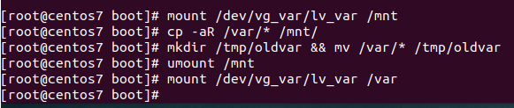

homework-LVM
Описание домашнего задания
---
1. уменьшить том под / до 8G
2. выделить том под /home
3. выделить том под /var (/var - сделать в mirror)
4. для /home - сделать том для снэпшотов
5. прописать монтирование в fstab (попробовать с разными опциями и разными файловыми системами на выбор)
   Работа со снапшотами:
1. сгенерировать файлы в /home/
2. снять снэпшот
3. далить часть файлов
4. восстановиться со снэпшота

---
- Этап 1: Vagrantfile, предложенный для ДЗ, немного изменен (сделана загрузка из скаченного бокса, переименованна VM)
- Этап 2: Установка xfsdump. Оценка состояния дисков
```bash
yum -y install xfsdump
lsblk
lvmdiskscan
```  


---
- Этап 3: Уменьшить том под / до 8G
Подготовка временного тома для / раздела


```bash
pvcreate /dev/sda
vgcreate vg_root /dev/sda
lvcreate -n lv_root -l +100%FREE /dev/vg_root
```


Создание файловой системы и монтирование раздела для дальнейшего переноса данных
```bash
mkfs.xfs /dev/vg_root/lv_root
```


```bash
mount /dev/vg_root/lv_root /mnt
```


Копирование всех данных с / раздела в /mnt, проверка
```bash
xfsdump -J - /dev/VolGroup00/LogVol00 | xfsrestore -J - /mnt
ls /mnt
```


Сконфигурируем grub, чтобы при старте перейти в новый /.
Сымитируем текущий root, сделаем в него chroot и обновим grub:

```bash
for i in /proc/ /sys/ /dev/ /run/ /boot/; \
 do mount --bind $i /mnt/$i; done
chroot /mnt/
```


Обновим образ initrd. 

```bash
cd /boot ; for i in `ls initramfs-*img`; \
do dracut -v $i `echo $i|sed "s/initramfs-//g; \
s/.img//g"` --force; done
```


Чтобы при загрузке был смонтирован нужный root в файле /boot/grub2/grub.cfg заменяем 
```bash
rd.lvm.lv=VolGroup00/LogVol00
```
на 
```bash
rd.lvm.lv=vg_root/lv_root
```


```bash
lsblk
```


Изменяем размер старой VG и возвращаем на него рут:
Для этого удаляем старый LV и создаём новый:
```bash
lvremove /dev/VolGroup00/LogVol00
#Стоит отметить, что вот тут надо было обязательно выйти из супер режима и перезагрузиться, иначе было вот так 
```


```bash
lvcreate -n VolGroup00/LogVol00 -L 8G /dev/VolGroup00
# для наглядности я делаю вывод lsblk
```


Создаем ФС
```bash
mkfs.xfs /dev/VolGroup00/LogVol00
```


```bash
#монтируем 
mount /dev/VolGroup00/LogVol00 /mnt 
# и копируем
xfsdump -J - /dev/vg_root/lv_root | \
xfsrestore -J - /mnt
```


Сконфигурируем grub, за исключением правки /etc/grub2/grub.cfg

```bash
for i in /proc/ /sys/ /dev/ /run/ /boot/; \
 do mount --bind $i /mnt/$i; done
chroot /mnt/
grub2-mkconfig -o /boot/grub2/grub.cfg
```


```bash
cd /boot ; for i in `ls initramfs-*img`; do dracut -v $i `echo $i|sed "s/initramfs-//g; s/.img//g"` --force; done
```


---
- Этап 3: Выделить том под /var в зеркало

На свободных дисках создаем зеркало:

```bash
pvcreate /dev/sdd /dev/sdc
vgcreate vg_var  /dev/sdd /dev/sdc
```


```bash
lvcreate -L 950M -m1 -n lv_var vg_var
```


Создаем на нем ФС и перемещаем туда /var:
```bash
mkfs.ext4 /dev/vg_var/lv_var
```


```bash
mount /dev/vg_var/lv_var /mnt
cp -aR /var/* /mnt/
```


На всякий случай сохраняем содержимое старого var
```bash
mkdir /tmp/oldvar && mv /var/* /tmp/oldvar
```
Монтируем новый var в каталог /var:
```bash
umount /mnt
mount /dev/vg_var/lv_var /var
```


Правим fstab для автоматического монтирования /var:
```bash
echo "`blkid | grep var: | awk '{print $2}'` \
 /var ext4 defaults 0 0" >> /etc/fstab
```


Перезагружаемся в новый (уменьшенный) root


И удаляем временную Volume Group: 
```bash
lvremove /dev/vg_root/lv_root
vgremove /dev/vg_root
pvremove /dev/sdb
```


---
- Этап 5: Выделить том под /home

Выделяем том под /home по тому же принципу что делали для /var:
```bash
lvcreate -n LogVol_Home -L 2G /dev/VolGroup00

mkfs.xfs /dev/VolGroup00/LogVol_Home
mount /dev/VolGroup00/LogVol_Home /mnt/
cp -aR /home/* /mnt/
rm -rf /home/*
umount /mnt
mount /dev/VolGroup00/LogVol_Home /home/
```


Правим fstab для автоматического монтирования /home:
```bash
echo "`blkid | grep Home | awk '{print $2}'` /home xfs defaults 0 0" >> /etc/fstab
```


---
- Этап 5: Работа со снапшотами

Генерируем файлы в /home/:
```bash
touch /home/file{1..20}
```
Снимаем  снапшот:
```bash
lvcreate -L 100MB -s -n home_snap /dev/VolGroup00/LogVol_Home
#были некоторые сложности с путём
```


Удаляем часть файлов:
```bash
rm -f /home/file{11..20}
```
Процесс восстановления из снапшота:
```bash
umount /home
lvconvert --merge /dev/VolGroup00/home_snap
```


*ПРИМЕЧАНИЕ
```bash
mount /home
# А вот тут возник косяк. Не хотел монтироваться /home
#>>>mount: can't find /home in /etc/fstab
# Проблема оказалась в ошибке в команде, когда мы 
# Вносим изменения в fstab (упустил слеш)
# Хотел попробовать примонтировать по UUID, увидел косяк, поправил руками

mount /home
ls -al /home
```

